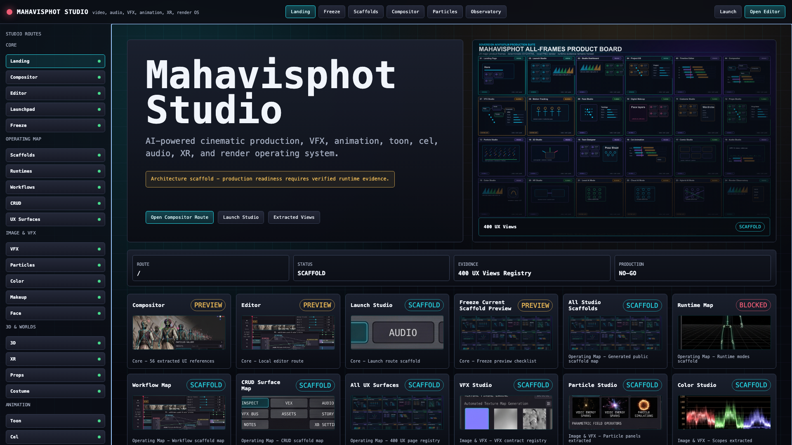
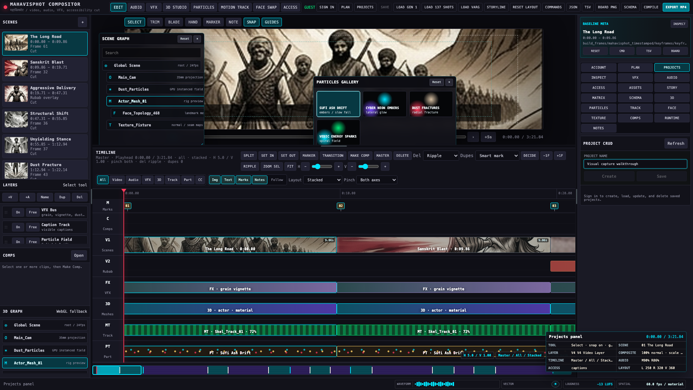
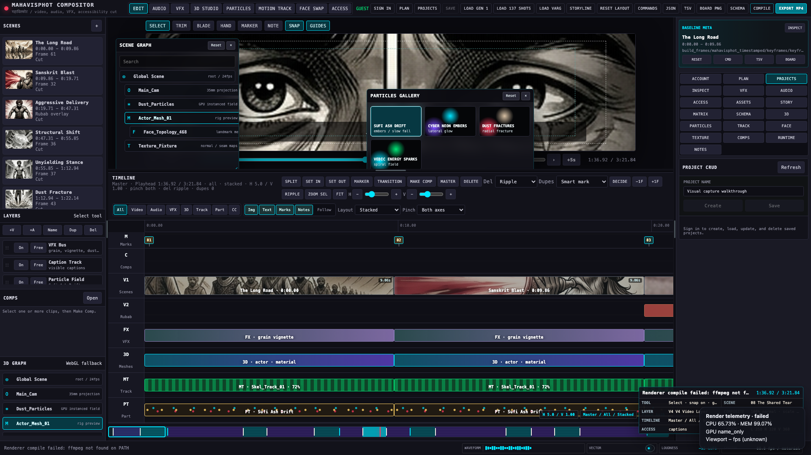

# Mahavisphot Compositor Pro v3.5 User Manual

Document version: 2026.06.11.v3
Generated: 2026-06-11T16:42:57.942Z
Verification state: GATE_GREEN__AI_RUNTIMES_HONESTLY_GATED__NOT_PRODUCTION_READY
Production ready: false

This manual is compiled from local capture assets and release-gate evidence. It does not invent browser states, telemetry, render success, or runtime readiness. If the capture pipeline cannot prove a state, the state is listed as pending or blocked.

## 1. Studio Routing

The root route `/` opens the Mahavisphot Studio landing gateway. The live editor route `/editor` opens the NLE workspace with timeline, viewer, inspector, tracks, schema export, telemetry, and render compile controls.

## 2. Timeline Workspace Operations

The capture suite enters the editor through the visible route button, adds a video layer through coordinate-derived mouse input, opens the project CRUD panel, and inserts a walkthrough project name into the live text field without saving local project data.

Core operator actions:

- Ingest media through the editor's safe media roots and project API.
- Add video or audio layers with the layer controls.
- Jog the playhead, trim clips, add markers, and switch timeline modes.
- Export schema manifests or request a schema-native render compile.

## 3. Playhead Motion Matrix

The visual capture suite samples the jog slider and playhead geometry at multiple 1920x1080 viewport coordinates. The raw matrix is stored at `docs/mahavisphot/manual/assets/playhead-motion-matrix.json`.

| Asset | Capture intent | Present |
| --- | --- | --- |
| `01_studio_landing.png` | Root studio landing | yes |
| `02_nle_timeline_workspace.png` | NLE timeline workspace after coordinate-driven UI input | yes |
| `03_telemetry_hud_active.png` | Real render telemetry HUD during compile attempt | yes |
| `04_render_compile_terminal_state.png` | Actual terminal compile state | yes |
Motion matrix samples: 6
Video status: webm_and_mp4
Walkthrough WebM: `exports/automation/workspace_walkthrough.webm`
Walkthrough MP4: `exports/automation/workspace_walkthrough.mp4`

## 4. Real Telemetry HUD

The editor creates `#renderTelemetryHud` from the actual compile flow. The suite captures the HUD only after the app starts polling `/api/v1/telemetry`; it does not append a synthetic diagnostic layer.

Release-gate loudness evidence:

`Integrated loudness: -13.8 LUFS | True peak: -3.4 dBTP | Over ceiling: false | Conforms: true`

## 5. Compile And Export Gate

The compile button dispatches the schema-native render path. The final capture records the actual terminal state, whether compiled, failed, or timed out.

Compile capture status: `failed_or_timed_out`

Compile status text: `Renderer compile failed: ffmpeg not found on PATH`

## 6. Runtime Readiness

Current runtime status from the release-gate verdict:

- editor: ready
- media: ready
- render: ready
- audio: ready
- local_ai: blocked
- cloud_ai: blocked
- hybrid_ai: blocked

Known blockers:

- local_ai: no local model runtime configured (set MAHAVISPHOT_MODEL_DIR to a populated model directory)
- cloud_ai: no provider credentials (set MAHAVISPHOT_CLOUD_API_KEY)
- hybrid_ai: local AI leg not ready; cloud AI leg not ready

## 7. Local Artifacts

- Screenshots: `docs/mahavisphot/manual/assets/`
- Capture metadata: `docs/mahavisphot/manual/assets/capture-metadata.json`
- Motion matrix: `docs/mahavisphot/manual/assets/playhead-motion-matrix.json`
- Walkthrough recording: `exports/automation/workspace_walkthrough.webm`
- MP4 recording: generated at `exports/automation/workspace_walkthrough.mp4` when ffmpeg is available.
